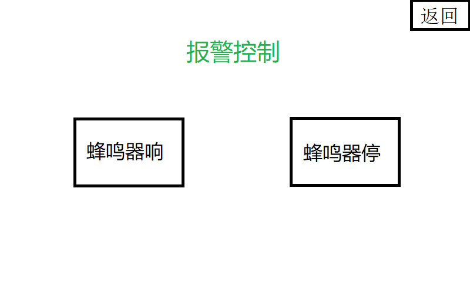
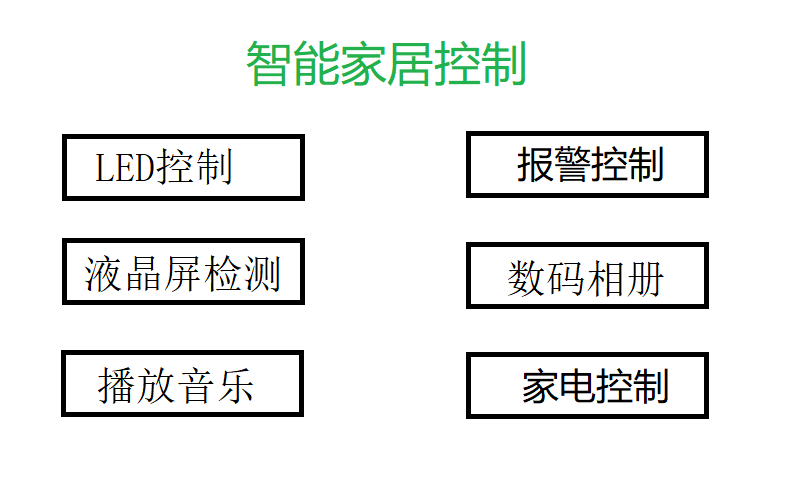
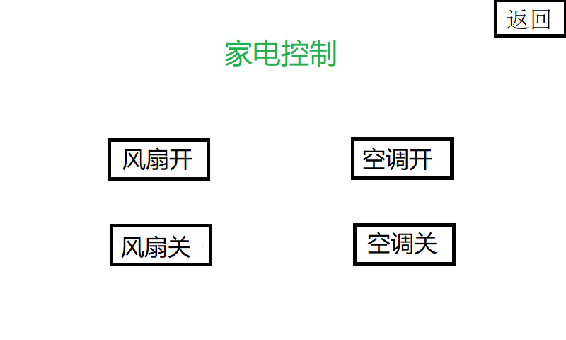
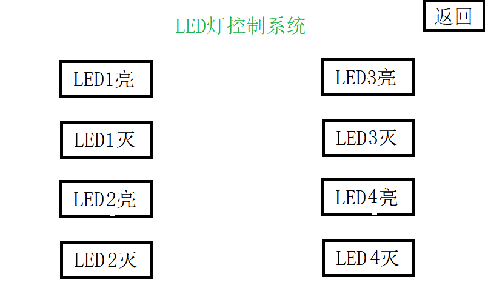
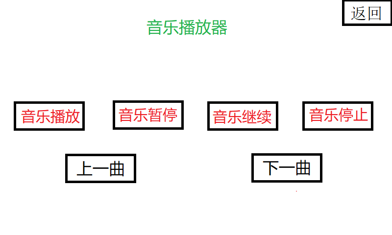

# Lv87-GEC6818-Smart-Home-System
* ## 项目目录结构
  * main            (程序可执行文件)
  
  * led_drv.ko      (编译好的led驱动文件)
  
  * beep_drv.ko     (编译好的蜂鸣器驱动文件)
  
  * image           (BMP图片目录)
    
    * photo                     (相册)
    
    * InteractiveInterface      (交互控制界面)
      
        
      
        
      
        
      
        
      
        
      
        
  
  * music           (MP3音频文件)